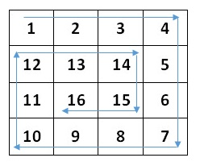

# Spiral Traverse
### Problem Statement
Given a 2-D array, we need to print the elements spirally. 

### Solution
There are two common methods to solve this problem.
1. keeping track of direction (tedious)
2. Using perimeter method (used in this repo)
  1. Non-recursive method (using a while loop).
  2. Using recursion
